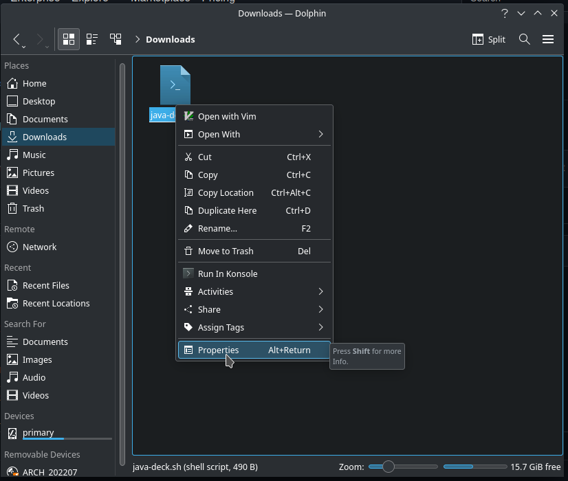
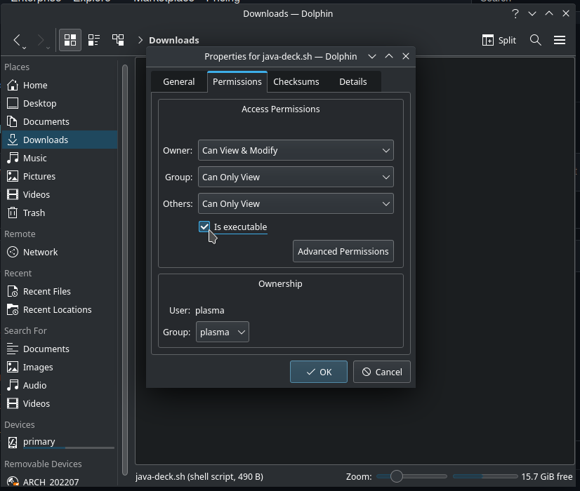

# Java for Steam Deck
Due to the nature of SteamOS being immutable, the traditional way of installing java on arch via pacman won't work.

# So... why not install Java to $HOME?
Great idea, and this is exactly what this script does. It takes a binary release of OpenJDK and extracts them to the home directory, and the java binary there gets added to PATH

# GUIDE
So... let's start.
## GUI Guide (WIP)
1. Right click on this [hyperlink](https://github.com/RushingAlien/java-deck/raw/master/java-deck.sh) and then click "Save page as..." and save the file
2. In the Deck's file manager, Dolphin, right click on the file, and then click properties

3. In the properties dialog, go the the permissions tab and then click on "Is executable" and then click "Ok"

4. Now right click the file again, and select "Run in Konsole"

## Terminal Guide
For you who uses the terminal, you can just copy and paste this to your terminal 
```bash
curl -L https://raw.githubusercontent.com/RushingAlien/java-deck/master/java-deck.sh | bash
```